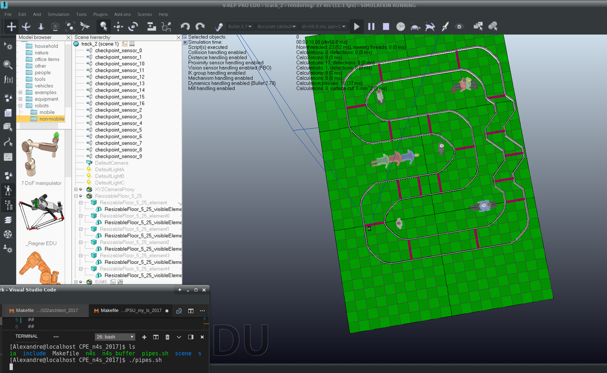

## Description

Introduction to Artificial Intelligence

## Compilation

```bash
make
```

## Screenshot



## Contributors

This project has been made with :
- Jérémy Pellerin

## Skills

- Overview of "Artificial Intelligence" domain 
- Introduction to research in a state-space 
- Awareness of the data structure problems and algorithmic complexity 
- Methodical approach to measuring a program's performance 
